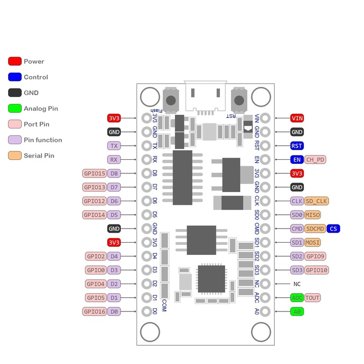
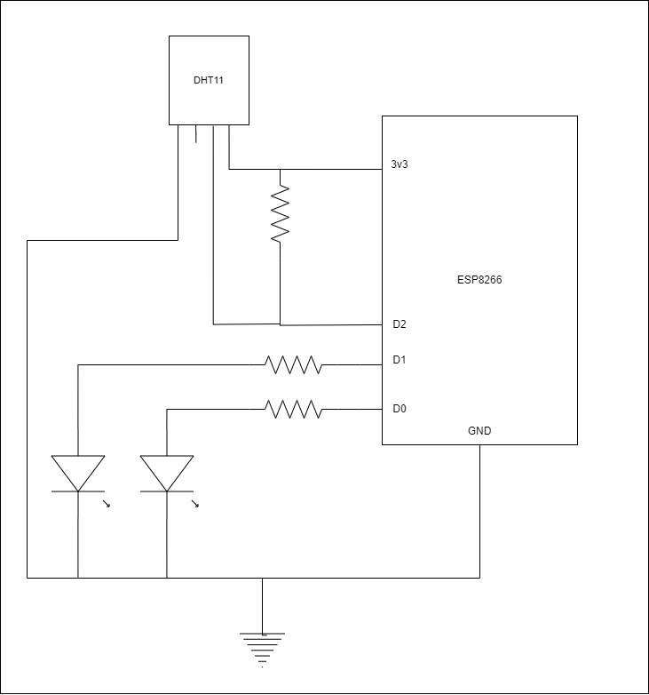

# ESP8266 LED vezérlő dokumentáció
## 1. A platform bemutatása
  Az ESP8266EX NodeMCU v3 egy alacsony költségű, Wi-Fi-képes mikrokontroller, amely ideális választás IoT-projektekhez. A beépített TCP/IP protokollstack lehetővé teszi az egyszerű vezeték nélküli hálózati csatlakozást, miközben a GPIO-lábak különféle perifériák vezérlésére használhatók.

  Ez a projekt a következő fő funkciókat valósítja meg:

  - Hőmérséklet- és páratartalom-érzékelés DHT11 szenzorral.
  - LED-ek állapotának szabályozása a mért hőmérséklet alapján.
  - Egy webes interfész, amely valós időben jeleníti meg az érzékelő adatokat, valamint a LED-ek aktuális állapotát.

  **Az ESP8266EX NodeMCU v3 fő jellemzői**
 - Processzor: 32 bites Tensilica L106, 80 MHz-es órajellel.
 - Wi-Fi: 802.11 b/g/n támogatás beépített TCP/IP stackkel.
 - GPIO lábak: 11 elérhető különféle perifériákhoz.
 - Flash memória: 4 MB.
 - Feszültség: 3,3V-os működés, USB-ről történő tápellátással.



## 2. Tervdokumentáció
**Kapcsolási rajz és felépítés**



  A projektben az ESP8266EX-hez egy DHT11 hőmérséklet- és páratartalom-érzékelő, valamint két LED (piros és zöld) csatlakozik. Az alábbi táblázat összefoglalja a csatlakozásokat:

| ESP8266 GPIO	| Alkatrész	| Funkció |
|:-----------:|:---------:|:-----:|
| GPIO4	(D2) | DHT11	| Hőmérséklet- és páratartalom mérés |
| GPIO16 (D0) | Piros LED | Hőmérséklet alapú visszajelzés |
| GPIO5 (D1) | Zöld LED |	Hőmérséklet alapú visszajelzés |

**Alkatrészlista**
| Alkatrész |	Mennyiség |	Leírás |
|:---------:|:---------:|:------:|
| ESP8266EX |	1 |	Wi-Fi képes mikrokontroller |
| DHT11 |	1	| Hőmérséklet- és páratartalom-érzékelő |
| Piros LED |	1 |	Hőmérséklet-visszajelzés |
| Zöld LED |	1 |	Hőmérséklet-visszajelzés |
| Ellenállás (220Ω) |	2 |	LED-ek áramkorlátozásához |
| Vezetékek	| Több |	Csatlakozások |

## 3. A megvalósítás leírása
**Működési leírás**

 1. Az ESP8266EX a DHT11 érzékelő segítségével méri a környezeti hőmérsékletet és páratartalmat.
 1. A mért hőmérséklet alapján vezérli a LED-ek állapotát:
    - Zöld LED: Világít, ha a hőmérséklet a felhasználó által megadott minimum és maximum határértékek között van.
    - Piros LED: Világít, ha a hőmérséklet kívül esik az optimális tartományon.
 1. Az adatokat egy webes felületen jeleníti meg, amelyen keresztül a felhasználó módosíthatja a minimum és maximum hőmérsékleti határértékeket.

**Részletes működés**

A fő működési ciklus a következő lépésekből áll:

  1. **Hőmérséklet- és páratartalom-mérés:** Az ESP8266 olvassa a DHT11 érzékelőt és ellenőrzi az adatokat.

```cpp
float temperature = dht.readTemperature();
float humidity = dht.readHumidity();
if (isnan(temperature) || isnan(humidity)) {
    Serial.println("Failed to read from DHT sensor!");
    return;
}
```

Ha a mért adatok érvényesek, a rendszer továbblép a LED-ek vezérlésére.

  2. **LED-ek vezérlése:** A mért hőmérséklet összehasonlítása a webes felületen beállított határértékekkel, és a LED-ek megfelelő vezérlése:

```cpp
if (temperature >= tempMin && temperature <= tempMax) {
    digitalWrite(greenLED, HIGH);
    digitalWrite(redLED, LOW);
} else {
    digitalWrite(redLED, HIGH);
    digitalWrite(greenLED, LOW);
}
```

Ez egyszerű, átlátható logikával biztosítja a vizuális visszajelzést.

  3. **Webes felület frissítése:** A webes felületen az aktuális érzékelőadatok, a LED-ek állapota, valamint az aktuális hőmérsékleti határértékek jelennek meg. Az értékek frissíthetők egy űrlapon keresztül:

```cpp
client.println("<form action=\"/update\" method=\"get\">");
client.println("<label for=\"tempMin\">Minimum hőmérséklet:</label>");
client.println("<input type=\"number\" id=\"tempMin\" name=\"tempMin\" step=\"0.1\" value=\"" + String(tempMin) + "\"><br>");
client.println("<label for=\"tempMax\">Maximum hőmérséklet:</label>");
client.println("<input type=\"number\" id=\"tempMax\" name=\"tempMax\" step=\"0.1\" value=\"" + String(tempMax) + "\"><br>");
client.println("<input type=\"submit\" value=\"Mentés\">");
client.println("</form>");
```

A felhasználó által beküldött adatokat az ESP8266 dolgozza fel:

```cpp
if (header.indexOf("GET /update") >= 0) {
    int tempMinIndex = header.indexOf("tempMin=");
    int tempMaxIndex = header.indexOf("tempMax=");
    
    if (tempMinIndex != -1 && tempMaxIndex != -1) {
        String tempMinValue = header.substring(tempMinIndex + 8, header.indexOf('&', tempMinIndex));
        String tempMaxValue = header.substring(tempMaxIndex + 8, header.indexOf(' ', tempMaxIndex));
        
        tempMin = tempMinValue.toFloat();
        tempMax = tempMaxValue.toFloat();
        
        Serial.println("Updated temperature limits:");
        Serial.println("tempMin: " + String(tempMin));
        Serial.println("tempMax: " + String(tempMax));
    }
}
```

## 4. Következtetések
Ez a projekt bemutatja az ESP8266EX IoT környezetben való alkalmazását az alábbiak szerint:

 - **Valós idejű adatmegjelenítés és vezérlés:** Az adatokat a webes felület folyamatosan frissíti, a LED-ek pedig azonnal reagálnak a hőmérsékleti változásokra.
 - **Felhasználóbarát konfiguráció:** A webes interfész lehetővé teszi a hőmérsékleti határértékek egyszerű módosítását.
 - **Bővíthetőség:** A rendszer könnyen kibővíthető további érzékelőkkel vagy vezérlőkkel.
